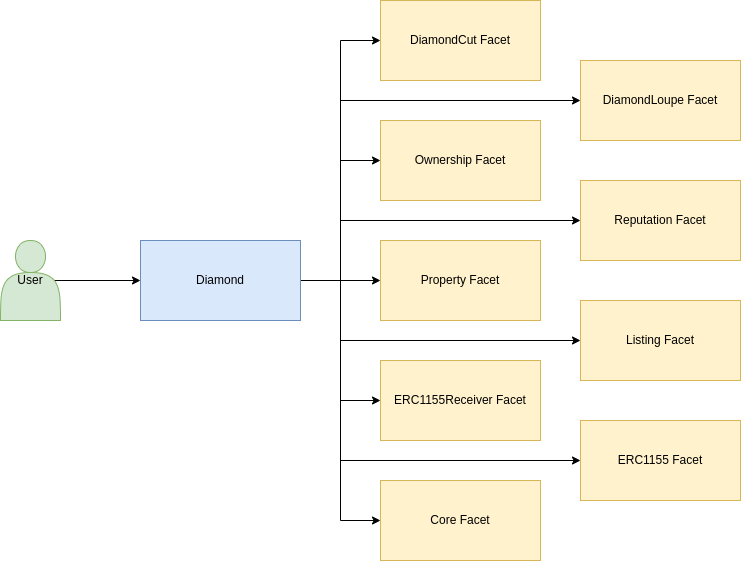

# DeRent

A decentralized house renting platform developed as final project for Alchemy University Ethereum Bootcamp.

## Overview

The project is built using the [EIP2535](https://eips.ethereum.org/EIPS/eip-2535) Diamond Proxy standard, for contract upgradability and Foundry, and the [ERC1155](https://eips.ethereum.org/EIPS/eip-1155) Multi Token standard to manage user houses as NFTs and their balances. As its focus is on implementing the Diamond Proxy standard, the number of features is limited:

* Mint a house NFT for rental: A user can mint a property as an NFT and make it available for rental.
* On-chain credit score: Users have an on-chain credit score that is directly updated based on their payment performance. Owners can use this score to determine the acceptability of a rental request.
* Rental collateral: On rental request, the user must deposit an equivalent of 2 times the rent price. This deposit will serve as collateral if the tenant fails to pay on time, allowing the owner to claim it as payment.
* Post-rental voting and property rating: At the end of the rental period, both parties can vote on each other, and the tenant can also assign a score to the property.
* Deposit withdrawal: Once the rental agreement is complete, the tenant can withdraw the initial deposit if it is still available.

A posible future improvement would be to allow users to set their rental terms. For example, a user with a payment score below 4 would have his request immeadiately rejected by the protocol if the owner decided so.

## Architecture

### Contracts Required by EIP2535

* [DiamondCutFacet](./contracts/diamond/facets/DiamondCutFacet.sol): Contract in charge of handling the update logic of the diamond.
* [DiamondLoupeFacet](./contracts/diamond/facets/DiamondLoupeFacet.sol): Contract in charge of introspection. Allows to se the facet addresses and their functions.
* [Diamond](./contracts/diamond/Diamond.sol): The proxy contract that handles the routing logic to send user requests to the correct facet if one is available.

### Other Contracts

* [OwnershipFacet](./contracts/diamond/facets/OwnershipFacet.sol): Implementor of the [ERC173](https://eips.ethereum.org/EIPS/eip-173) standard for contract ownership.
* [ReputationFacet](./contracts/facets/ReputationFacet.sol): Contract that exposes functions to read users and properties scores.
* [PropertyFacet](./contracts/facets/PropertyFacet.sol): Contract in charge of handling properties that are available for rental.
* [ListingFacet](./contracts/facets/ListingFacet.sol): A contract that aggregates the properties' data and exposes it in a single place.
* [ERC1155TokenReceiverFacet](./contracts/facets/ERC1155TokenReceiverFacet.sol): Implementor of the [ERC1155TokenReceiver](https://eips.ethereum.org/EIPS/eip-1155#erc-1155-token-receiver) interface.
* [ERC1155Facet](./contracts/facets/ERC1155Facet.sol): A readonly implementation of the [ERC1155](https://eips.ethereum.org/EIPS/eip-1155) standard.
* [CoreFacet](./contracts/facets/CoreFacet.sol): Contract that handles the rental logic.

### Diagram

## Resources

The only set of resources you'll ever need to undestand [EIP2535](https://eips.ethereum.org/EIPS/eip-2535)

* [Awesome Diamonds](https://github.com/mudgen/awesome-diamonds)
